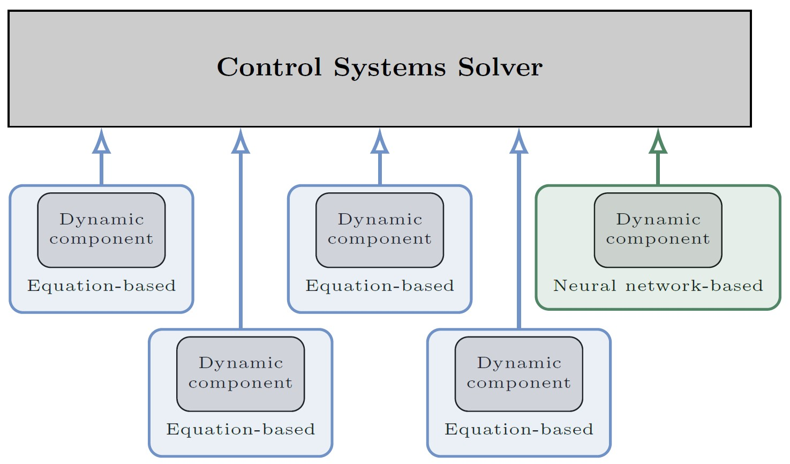

# PINNs in EMT simulation solvers
This library provides an Electromagnetic Transients (EMT) simulation solver for a type-4 wind turbine model connected through an LCL filter to an external source. The wind turbine model represents the grid-side converter as a voltage source and assumes a constant DC voltage. The control system is implemented in vector form using a dq frame, consisting of a synchronous reference frame, a Phase-Locked Loop (PLL), and cascaded PI controls that control active power injected into the external source and voltage magnitude at the PCC. The modulation block is assumed ideal. The system is based on the CIGRE benchmark model C4.49, as described in the "Multi-frequency stability of converter-based modern power systems" brochure.
The simulation solver integrates Neural Networks (NNs) and Physics-Informed Neural Networks (PINNs) to enhance the black-boxing capabilities of solvers with IP-protected control systems and to accelerate simulations when avoiding iterative solutions.

## Details in the associated paper
The motivation, methodology, and applications are discussed in the following paper under review:
> [!NOTE]
> 
> I. Ventura, N. Darii, P. Aristidou, M. K. Bakhshizadeh, R. Nellikkath, B. Vilmann, and S. Chatzivasileiadis, *Physics-Informed Neural Network Models for EMT Simulators*, 2026.

## Installation

To install the latest on GitHub:

```
pip install git+https://github.com/ignvenad/PINNs-in-EMT
```

## Examples
We encourage those who are interested in using this library to simulate the system with three different approaches to solve the synchronous reference-frame phase-locked loop controller (SRF-PLL): the Newton-Raphson method [solver_nr.py](https://github.com/ignvenad/PINNs-in-EMT/blob/main/solver_nr.py), the one-time-step delay approach [solver_del.py](https://github.com/ignvenad/PINNs-in-EMT/blob/main/solver_del.py), and the proposed NN-based surrogate model [solver_mlp.py](https://github.com/ignvenad/PINNs-in-EMT/blob/main/solver_mlp.py). To reproduce the same simulations and results shown in the paper, use the variables and parameters written below.


- `--sim_time` is the simulation time.
- `--sim_step` is the time step used by the algorithm.
- `--plot_step` is the recording time step used to save the results for plotting and storing the simulation data.
- `--Sim_Plotter` implements the developed post-processing and plotting capabilities.
- `--compute_extra_arrays` is an optional function to compute extra simulation variables. 
- `--save_arrays` when active, it stores all the simulation data, as well as the simulation parameters, computational time, and time where the simulation was run. 
- `--show_plot` flag for plotting at the end of the simulation.
- `--save_steady_state` function, if required, to compute the initial conditions of the simulation.

#### All electric parameters, control gains and reference setpoints can be changed in the simulation's YAML file:
- `system_params` include R1, L1, R2, L2, R3, C3, and the system's frequency.
- `control_params` include the PI control gains for the outer and inner control loops as well as the SRF-PLL gains. These are labelled as Kp_cci, Ki_cci, Kp_pco, Ki_pco, Kp_pll, and Ki_pll.
- `system_params` include the system base values for power (Sbase) and voltage as the L-L rms value (Vbase).
- `external_grid` includes the initial voltage magnitude and phase angle of the external grid V_nom and Angle_ini.


#### Supported types of faults (must be specified in "events" variable in the simulation's yaml file):
- `Active power reference step`: fault type 'P', which requires the fault time and the new setpoint value.
- `Voltage magnitude reference step`: fault type 'V', which requires the fault time and the new setpoint value.
- `Grid voltage sag`: fault type 'CC', which requires the fault time and the fault duration.
- `Grid voltage phase angle jump`: fault type 'PJ', which requires the fault time and the magnitude of the phase jump.

#### System parameters
The default system parameters are the following.
| **Variable** | **Value** (%)  | **Variable** |
|-----------|--------|-----------|
|$S_{b}$ | Rated power      |100 MW|
|$V_{g}$ | Nominal grid voltage      | 100 kV |
|$f_{0}$ | Rated frequency      |50 Hz|
|$T_{s}$ | Simulation time step size | {1-100} $\mu s$ |
|$K_{pll}$ | SRF PLL gains (kp, ki) | 25, 300 |
|$K_{pc}$ | Power controller gains (kp, ki) | 0.5, 30 |
|$K_{cc}$ | Current controller gains (kp, ki) | 0.1, 20 |
|$r_{c}, L_{c}$ | Converter-side inductor (pu) | 0.005, 0.1 |
|$r_{f}, C_{f}$ | Filter capacitor (pu) | 0.0757, 0.00184 |
|$r_{Lg}, L_{g}$ | Grid-side inductor (pu) | 0.005, 0.1 |

## Basic Usage
This library provides three main interfaces which can simulate the same systems with different solution approaches described above: the Newton-Raphson method [solver_nr.py](https://github.com/ignvenad/PINNs-in-EMT/blob/main/solver_nr.py), the one-time-step delay approach [solver_del.py](https://github.com/ignvenad/PINNs-in-EMT/blob/main/solver_del.py), and the proposed NN-based surrogate model [solver_mlp.py](https://github.com/ignvenad/PINNs-in-EMT/blob/main/solver_mlp.py). 

This repository also includes two additional packages:


The `main` file leverages two main scripts:
- [PSCAD_FORTRAN_SETUP](https://github.com/ignvenad/PINNs-in-EMT/blob/main/PSCAD_FORTRAN_SETUP) provides the FORTRAN code that is incorporated into PSCAD using a custom-made component implemented with the component wizard.
- [BLACK_BOXING](https://github.com/ignvenad/PINNs-in-EMT/blob/main/BLACK_BOXING) provides the solver when using NN-based methods as a black box. We showcase the same examples as in the paper, using the active power outer and inner control loops.


The `scr` folder contains this repository's plotting and MLP evaluating capabilities, `sim_setups` the simulation setup examples and the ones used for the simulations shown in the paper, `NN_models` a trained PINN that captures the SRF-PLL solution, and `Saved_trajectories` where the simulation data used in the paper is saved and analysed.

## Vision
As explained in the paper, we envision a modular PINN integration, where the user can decide if they want to incorporate NN-based surrogate models in the simulation and which components to replace. We define and implement accurate NNs and PINNs that capture the most computationally intensive components of the simulation or models, which need to remain confidential. PINNs provide faster and explicit evaluations of these components, thereby accelerating the underlying simulation algorithm when closed loops are captured. We envision a library of accurately trained PINN models that can significantly accelerate time-domain simulations. See the following figure.
<p align="center">

</p>

## Reproducibility

The results published in the pre-print can be attained by using the sim_setups: `params_pv_4events.yaml`, `params_pv_100events.yaml`, and `params_pv_break.yaml`, with each of the described solvers `solver_nr`, `solver_del`, and `solver_ml`.

#### Overview figure of the 4 events trajectory with the `solver_nr` and `solver_nn` solvers. The trajectories are saved in `Saved_trajectories` and compared with the provided [compare_sims.py](https://github.com/ignvenad/PINNs-in-EMT/blob/main/Saved_trajectories/compare_sims.py) script.

Depicts all simulation variables for the specific simulation and solvers.
<p align="center">

</p>

#### Overview figure of the 100 events trajectory with the `solver_nr` and `solver_nn` solvers. The trajectories are saved in `Saved_trajectories` and compared with the provided [compare_sims.py](https://github.com/ignvenad/PINNs-in-EMT/blob/main/Saved_trajectories/compare_sims.py) script.

Depicts all simulation variables for the specific simulation and solvers.
<p align="center">

</p>